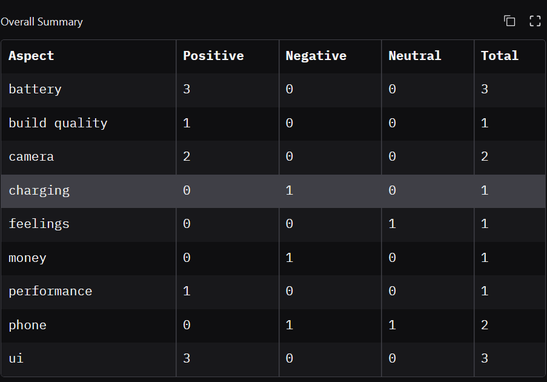
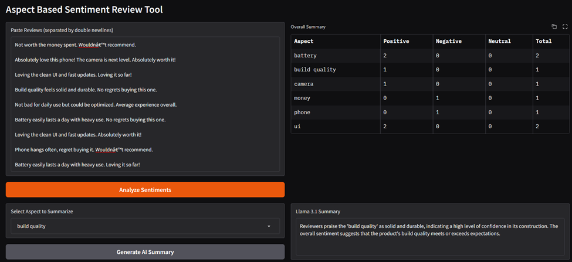

# Aspect Based Sentiment Review Tool

This is a Gradio app for analyzing product reviews. Users can paste reviews in the available text box, and the program will extract the aspects and associated sentiments. This is done using the PyABSA Python library. The result is displayed in a table that counts Positive, Negative, and Neutral mentions for each extracted aspect.

The app also includes an LLM summary for a user selected aspect. The user selects an aspect, and the LLM generates a summary using the reviews that mention the aspect.

## Features

- Process multiple reviews at once.
- Extract aspects from each sentence in the review.
- Count Positive, Negative, and Neutral mentions for each aspect.
- Display output in a Gradio table.
- Select one aspect and generate a short Llama 3.1 summary.
- Save raw PyABSA analysis results to `all_review_analysis_results.json`

## Input Format

Paste the reviews in the text box using the following format:

```
Review 1: Not worth the money spent. Wouldn't recommend.

Review 2: Absolutely love this phone! The camera is next level. Absolutely worth it!
```

Then press **Analyze Sentiments** to extract product aspects. For a summary, select an aspect from the dropdown and press **Generate AI Summary**.

## Output 

- A table showing the extracted aspect and the number of times it was mentioned with the associated sentiments. For example, in the image below battery is mentioned positively 3 times, none for the other sentiments, with a total of 3 mentions.


- An LLM summary about the aspect selected.


## Setup
- Python 3.11 is required. Otherwise, libraries may fail to install if using a newer version.
- Create a virtual environment, activate it, and install the requirements.

```bash
python -m pip install -r requirements.txt
```

- Create a `.env` file and add a Hugging Face token if you want to use the AI summary. Make sure to enable "Read access to contents of all repos under your personal namespace" and "Make calls to Inference Providers" when creating the token.

```text
HF_TOKEN=your_hugging_face_token
```

- Run the app.

```bash
python sentimentClassifier.py
```
